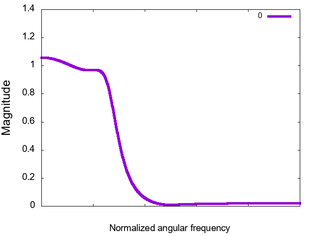
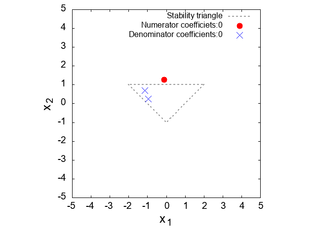

# DSPLAB C++ Library

## はじめに

ディジタル信号処理の関連した処理をまとめた、クロスプラットフォームのC++ソースコード群です。
ディジタルフィルタや音声ファイルなどを扱うことのできます。
メソッドの詳細は各クラスのMarkdownファイルに記載してあるリファレンスを確認して下さい。

### ライブラリの利用して作成したIIRフィルタの特性のデモ

## 動作環境

C++11のソースコードをコンパイルできる環境(以下は例)

- gcc : 4.8.1以上
- MSVC++ : Visual Studio 2017以上
- Embarcadero C++ Builder 

本ライブラリはソースコード形式で配布されるため、各自の環境でコンパイルする必要があります。
